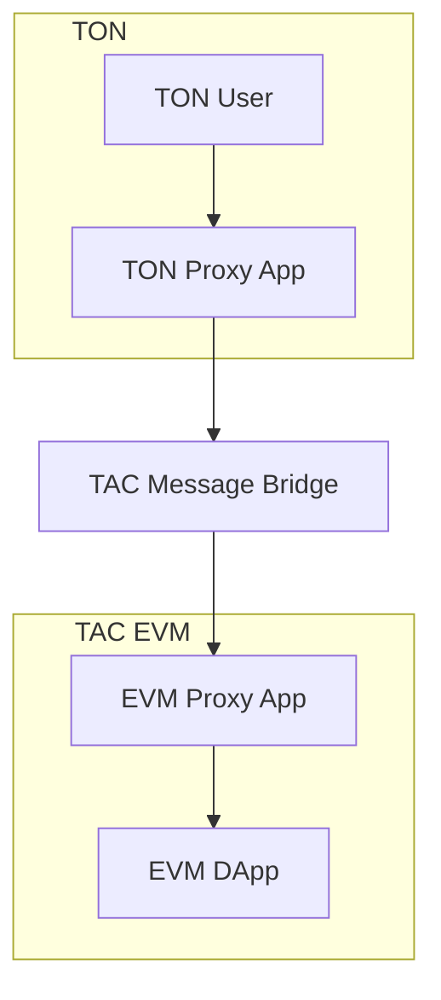
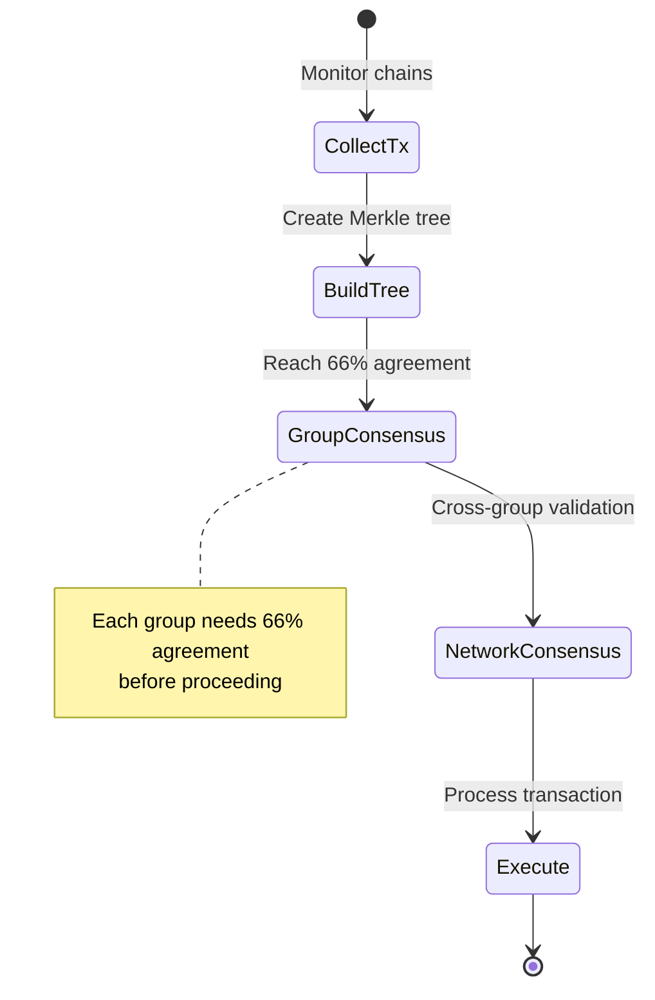

TAC creates a compatibility layer that connects TON with EVM-compatible applications. This architecture guide explains how TAC allows users to interact with EVM apps using their TON wallets through proxy applications and a secure sequencer network.

## System Overview

TAC consists of three main components:
1. TAC EVM: A dPoS Layer1 EVM chain built on CosmosSDK with Ethermint and re-secured by Babylon Bitcoin Staking
2. TAC Message Bridge: A decentralized Cross-chain layer on both TON and EVM sides secured by a set of sequencers
3. Proxy Apps: set of smart contracts (TON and TAC EVM) that enable direct application interaction

## TAC EVM Layer

### Overview
The TAC EVM Layer is an EVM Layer1 with dPoS that is built with [CosmosSDK](https://docs.cosmos.network/) + [Ethermint](https://docs.ethermint.zone/) (built on top of [Tendermint-Core](https://docs.tendermint.com/)).

The EVM execution environment is equivalent to the EVM specs for Ethereum mainnet, running a modified version of Geth 1.10 rebased to include the newly added OPCodes like Push0 and EIP-1559 for standard gasfee management or to provide sevices like debug_trace() API.

This solution offer the greatest level of compatibility and reusability of existing tools and middlewares. Developers can easily connect their EVM wallets or IDE directly to the TAC EVM Layer to deploy Solidity code that does not need any re-audit.

### EVM Security Model
The TAC EVM Layer is primarily secured by dPoS using Tendermint-Core consensus. This provide the right balance between decentralization of the network and throughput.

The number of permissionless validators will be set before going live on mainnet, but users will be able to delegate TAC tokens to existing validators to contribute to the security of the network.

Ethermint is built on Tendermint to offer same-block finality, and TAC EVM Layer [comes with 4 sec. blocktime and 10K blocsize] TODO! Sync with Ankr on this!

On top of the dPoS consensus that secure the network at the next block, TAC EVM Layer opted for an additional layer of security provided by Babylon Bitcoin (re)Staking: bitcoin holders can stake their BTC in a self-custodial way on the Bitcoin Blockchain and delegate Babylon validators to verify TAC EVM blocks and sign them. If a Babylon validator double-sign a block, the Babylon protocol will slash the staked BTCs, providing assurance for a greater economical security against double-spending on the TAC EVM Layer, coming from the amount of BTC at stake for TAC. This mechanisms delay a bit the finality of TAC EVM, but provide much more solid assurances and is rewarded with TAC token inflation.

TAC EVM Layer, being built on Tendermint-Core, cannot allow re-orgs.

## TAC Message Bridge

### Overview
The TAC Message Bridge is the cross-chain layer that connects TON with TAC EVM as a set of smart contracts handling:
- Transaction execution (call, mint, lock/unlock operations)
- Data availability
- Consensus
- Elections
- Cross-chain messaging

For more detailed information consult the [TAC lightpaper](#)

### Bridge Security Model

The sequencer network is a proof-of-stake based off-chain system that connects the TON and EVM chains. Sequencers form groups, with each group managing transaction validation and consensus.

### Bridge Sequencer Groups

Sequencer groups enhance security through decentralization. Each group:
- Contains multiple sequencer nodes
- Forms transaction trees independently
- Requires 66% internal consensus
- Must stake collateral as security

The group's collateral must stay above a minimum threshold set by DAO voting. While collateral amount doesn't affect voting power, it impacts profitability, encouraging groups to stake more for better security.

### Group Selection and Monitoring

Groups are selected through DAO voting or multisig processes. The system includes:
- Regular election cycles every N hours (DAO configurable)
- Performance monitoring and rating systems
- Penalty mechanisms for incorrect operations
- Collateral management for security

### Consensus Thresholds
- 66% agreement required within groups
- Cross-group consensus for network validation
- Configurable parameters through DAO voting

### Penalty System
- Groups can submit penalty applications
- Network-wide voting on penalties
- Slashing of staked collateral for violations

## Proxy Apps

DApp proxies are automatically generated for each application on both TON and EVM chains. These proxies enable:
- Direct wallet interaction from TON
- Cross-chain message formatting
- Asset transfer handling
- EVM application interaction

## Transaction Lifecycle

Every transaction in TAC follows these stages:

1. **Initialization**
  - User sends transaction through TON wallet
  - DApp proxy creates cross-chain message
  - Assets are sent to bridge wallet

2. **Event Detection**
  - Sequencers monitor for new events
  - Events are stored in local databases
  - Log messages are collected from TON

3. **Root Hash Generation**
  - Sequencers form Merkle trees from transactions
  - Trees are created regularly (timing set by DAO)
  - Root hashes are used for consensus

4. **Consensus Process**
  - Each group forms and validates trees
  - Groups submit identical trees for verification
  - Network-level consensus is achieved

5. **Transaction Execution**
  - Verified transactions are processed
  - Contract methods are called with parameters
  - Merkle proofs validate execution

6. **Finalization/Rollback**
  - Successful transactions update state
  - Failed transactions are collected for rollback
  - Commission is distributed to sequencers
