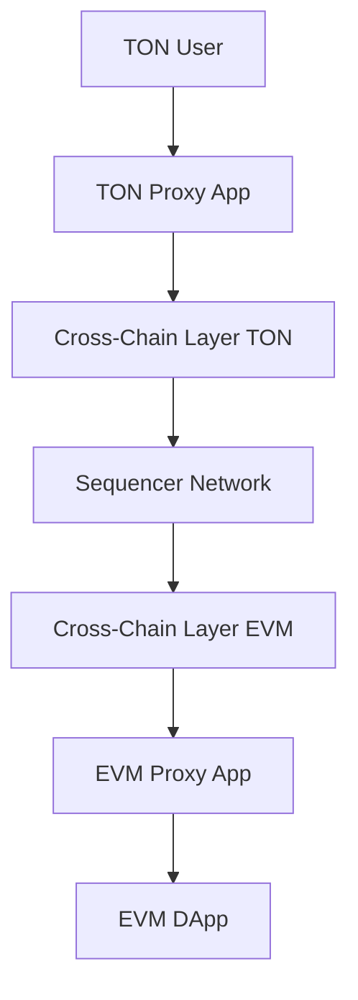
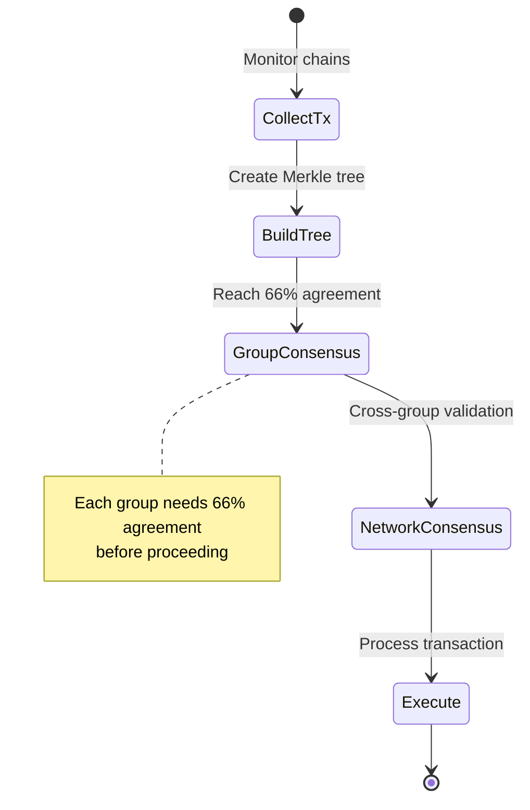

TAC creates a seamless bridge between TON and EVM chains, enabling direct interaction between TON users and EVM applications. This architecture guide explains how TAC's components work together to make cross-chain interactions possible.

## System Overview 

At its core, TAC consists of cross-chain messaging layers on both TON and EVM chains, connected by a decentralized network of sequencers. When a TON user wants to interact with an EVM application, they use automatically generated proxy contracts that handle all the complexities of cross-chain communication.

## Cross-Chain Messaging Layer

The cross-chain messaging layer forms the backbone of TAC, existing on both TON and EVM chains. On the TON side, it manages transaction validation, asset locking, and message generation. The EVM side handles message verification, asset unlocking or minting, and final transaction execution.

This layer includes smart contracts that work together to ensure secure cross-chain communication. The MessageProcessor contract validates incoming transactions, while the AssetVault handles token locking and unlocking. A StakeManager contract oversees validator stakes and rewards, and the ConsensusContract coordinates agreement between validator groups.

## Sequencer Network

The sequencer network is a decentralized group of nodes that ensure reliable message delivery between chains. These sequencers are organized into groups, each responsible for monitoring transactions, building Merkle trees, and reaching consensus on cross-chain messages.

Each sequencer group must reach internal consensus before a transaction can proceed. When a group identifies a new transaction, they form a Merkle tree and require 66% of nodes to agree on the tree's root hash. This consensus mechanism ensures that malicious actors cannot manipulate transaction ordering or content.

## Proxy Apps

Proxy apps are the user-facing component of TAC. These smart contracts are automatically generated for each EVM application and exist on both chains. They abstract away the complexity of cross-chain communication, making it feel native to users.

When a user interacts with a proxy app on TON, it handles all the necessary steps to:
1. Format the transaction for cross-chain transfer
2. Lock assets in the bridge contract
3. Generate appropriate cross-chain messages
4. Monitor transaction status

On the EVM side, the proxy:
1. Receives verified messages from the sequencer network
2. Unlocks or mints required assets
3. Interacts with the target EVM application
4. Returns results back through the cross-chain layer

## Transaction Flow

A typical cross-chain transaction in TAC follows several stages. When a user initiates a transaction through their TON wallet, the proxy app creates a cross-chain message and locks any required assets. This message is picked up by sequencers who validate it and form a Merkle tree.

The sequencer groups must reach consensus on this tree before the transaction can proceed. Once consensus is achieved, the transaction is executed on the EVM side, where assets are unlocked and the target application method is called.

Consider this example flow:
1. A TON user wants to swap tokens on an EVM DEX
2. They interact with the TON proxy app
3. Their tokens are locked in the bridge contract
4. Sequencers validate the transaction and reach consensus
5. The EVM proxy receives the verified message
6. It unlocks the tokens and executes the swap
7. The result is sent back through the same process

## Security Model

Security in TAC is maintained through a combination of economic incentives and technical mechanisms. Sequencer groups must stake significant collateral, which can be slashed if they misbehave. The multi-level consensus system requires agreement both within groups and between them, making attacks prohibitively expensive.

The consensus mechanism requires 66% agreement within each group before a transaction can proceed. This high threshold ensures that even if some nodes are compromised, they cannot affect the network without controlling a supermajority of nodes.

## Development Integration

For developers looking to integrate with TAC, we provide a comprehensive SDK that handles the complexities of cross-chain communication. The SDK manages wallet connections, transaction building, and message formatting, letting you focus on your application logic.

## Network Parameters

The TAC network's behavior is governed by several key parameters, many of which are controlled by DAO voting. These include consensus thresholds, minimum stake requirements, and reward distributions. The current mainnet configuration sets a 24-hour execution window for transactions and requires 66% consensus within sequencer groups.
