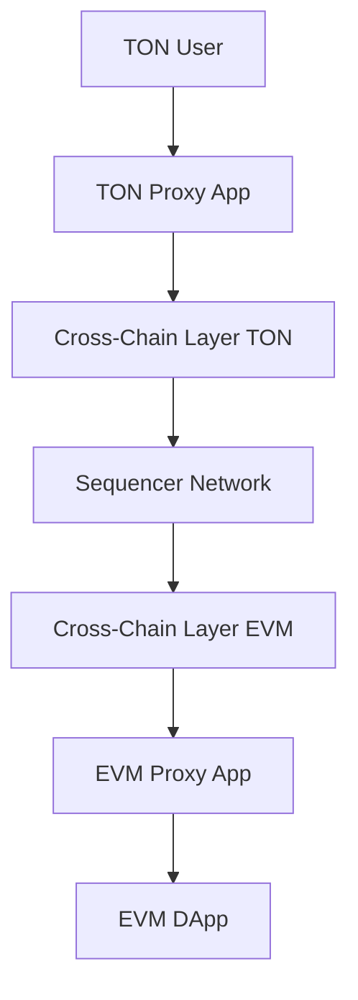
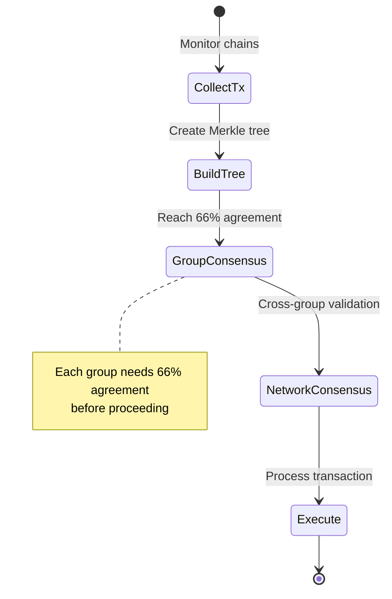

TAC (TON App Chain) creates a compatibility layer that connects TON with EVM-compatible applications. This architecture guide explains how TAC allows users to interact with EVM apps using their TON wallets through proxy applications and a secure sequencer network.

## System Overview 

TAC consists of three main components:
1. Cross-chain layers on both TON and EVM sides
2. A decentralized sequencer network
3. DApp proxies that enable direct application interaction

## Cross-Chain Layer

The cross-chain layer exists on both TON and EVM chains as a set of smart contracts handling:
- Transaction execution (call, mint, lock/unlock operations)
- Data availability
- Consensus 
- Elections
- Cross-chain messaging

## Sequencer Network

The sequencer network is a proof-of-stake based off-chain system that connects the TON and EVM chains. Sequencers form groups, with each group managing transaction validation and consensus.

### Sequencer Groups

Sequencer groups enhance security through decentralization. Each group:
- Contains multiple sequencer nodes
- Forms transaction trees independently
- Requires 66% internal consensus
- Must stake collateral as security

The group's collateral must stay above a minimum threshold set by DAO voting. While collateral amount doesn't affect voting power, it impacts profitability, encouraging groups to stake more for better security.

### Group Selection and Monitoring

Groups are selected through DAO voting or multisig processes. The system includes:
- Regular election cycles every N hours (DAO configurable)
- Performance monitoring and rating systems
- Penalty mechanisms for incorrect operations
- Collateral management for security

## Proxy Apps

DApp proxies are automatically generated for each application on both TON and EVM chains. These proxies enable:
- Direct wallet interaction from TON
- Cross-chain message formatting
- Asset transfer handling
- EVM application interaction

## Transaction Lifecycle

Every transaction in TAC follows these stages:

1. **Initialization**
  - User sends transaction through TON wallet
  - DApp proxy creates cross-chain message
  - Assets are sent to bridge wallet

2. **Event Detection**
  - Sequencers monitor for new events
  - Events are stored in local databases
  - Log messages are collected from TON

3. **Root Hash Generation**
  - Sequencers form Merkle trees from transactions
  - Trees are created regularly (timing set by DAO)
  - Root hashes are used for consensus

4. **Consensus Process**
  - Each group forms and validates trees
  - Groups submit identical trees for verification
  - Network-level consensus is achieved

5. **Transaction Execution**
  - Verified transactions are processed
  - Contract methods are called with parameters
  - Merkle proofs validate execution

6. **Finalization/Rollback**
  - Successful transactions update state
  - Failed transactions are collected for rollback
  - Commission is distributed to sequencers

## Security Model

TAC's security relies on group consensus and economic incentives:

### Consensus Thresholds
- 66% agreement required within groups
- Cross-group consensus for network validation
- Configurable parameters through DAO voting

### Penalty System
- Groups can submit penalty applications
- Network-wide voting on penalties
- Slashing of staked collateral for violations
